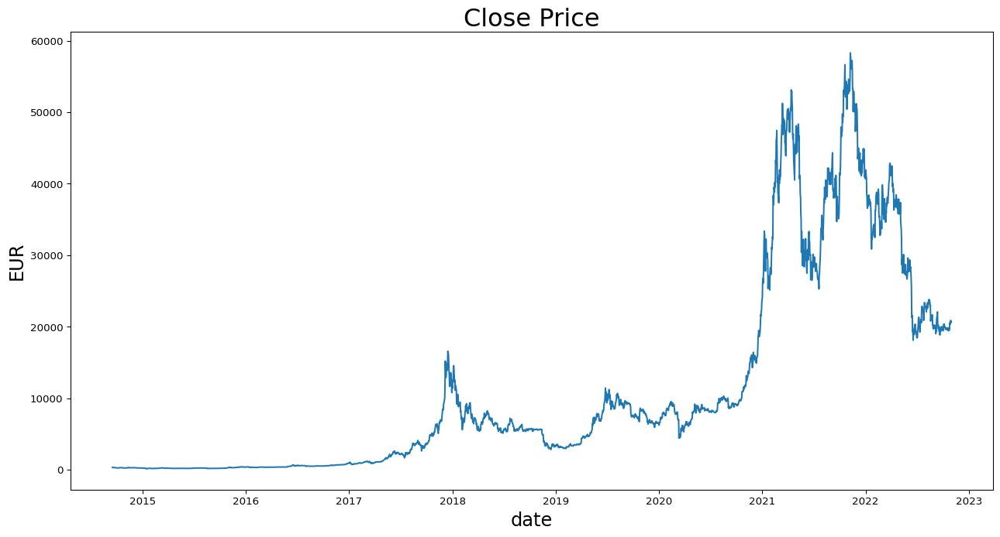
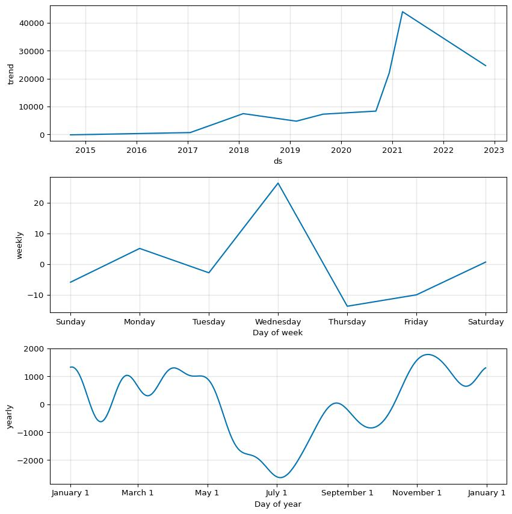
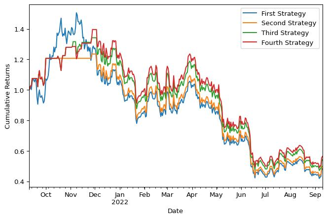

<script src="https://cdnjs.cloudflare.com/ajax/libs/require.js/2.3.6/require.min.js" integrity="sha512-c3Nl8+7g4LMSTdrm621y7kf9v3SDPnhxLNhcjFJbKECVnmZHTdo+IRO05sNLTH/D3vA6u1X32ehoLC7WFVdheg==" crossorigin="anonymous"></script>
<script src="https://cdnjs.cloudflare.com/ajax/libs/jquery/3.5.1/jquery.min.js" integrity="sha512-bLT0Qm9VnAYZDflyKcBaQ2gg0hSYNQrJ8RilYldYQ1FxQYoCLtUjuuRuZo+fjqhx/qtq/1itJ0C2ejDxltZVFg==" crossorigin="anonymous"></script>
<script type="application/javascript"></script>


-   <a href="#motivation" id="toc-motivation">Motivation</a>
-   <a href="#visualising-bitcoin-price"
    id="toc-visualising-bitcoin-price">Visualising Bitcoin Price</a>
-   <a href="#using-prophet" id="toc-using-prophet">Using Prophet</a>
-   <a href="#developing-backtesting"
    id="toc-developing-backtesting">Developing Backtesting</a>
-   <a href="#results" id="toc-results">Results</a>

# Motivation

Being passionate about finance and familiar with using Facebook Prophet
for time-series forecasting, I decided it'd be a fascinating project to
investigate the profitability of a bitcoin trading strategy relying
solely on Facebook Prophet. There are many great reads about Facebook
Prophet used to predict bitcoin price
(e.g. [here](https://medium.com/geekculture/what-happens-if-you-day-trade-crypto-with-facebook-prophet-84df66c31657)),
but I haven't found a post anywhere that would fit the model every day,
make trades based on the output and backtest this strategy. Let's start
this exciting journey by importing the relevant libraries and reading
bitcoin data, for which purpose I'm using `yfinance`:

``` python
import pandas as pd
import numpy as np
import matplotlib.pyplot as plt
import yfinance as yf
from prophet import Prophet
from datetime import date, timedelta
import time

BTC_Ticker = yf.Ticker("BTC-EUR")
df = BTC_Ticker.history(period="max")
df.head()
```

<div>
<style scoped>
    .dataframe tbody tr th:only-of-type {
        vertical-align: middle;
    }

    .dataframe tbody tr th {
        vertical-align: top;
    }

    .dataframe thead th {
        text-align: right;
    }
</style>
<table border="1" class="dataframe">
  <thead>
    <tr style="text-align: right;">
      <th></th>
      <th>Open</th>
      <th>High</th>
      <th>Low</th>
      <th>Close</th>
      <th>Volume</th>
      <th>Dividends</th>
      <th>Stock Splits</th>
    </tr>
    <tr>
      <th>Date</th>
      <th></th>
      <th></th>
      <th></th>
      <th></th>
      <th></th>
      <th></th>
      <th></th>
    </tr>
  </thead>
  <tbody>
    <tr>
      <th>2014-09-17 00:00:00+00:00</th>
      <td>359.546204</td>
      <td>361.468506</td>
      <td>351.586884</td>
      <td>355.957367</td>
      <td>16389166</td>
      <td>0</td>
      <td>0</td>
    </tr>
    <tr>
      <th>2014-09-18 00:00:00+00:00</th>
      <td>355.588409</td>
      <td>355.505402</td>
      <td>319.789459</td>
      <td>328.539368</td>
      <td>26691849</td>
      <td>0</td>
      <td>0</td>
    </tr>
    <tr>
      <th>2014-09-19 00:00:00+00:00</th>
      <td>328.278503</td>
      <td>330.936707</td>
      <td>298.921021</td>
      <td>307.761139</td>
      <td>29560103</td>
      <td>0</td>
      <td>0</td>
    </tr>
    <tr>
      <th>2014-09-20 00:00:00+00:00</th>
      <td>307.665253</td>
      <td>329.978180</td>
      <td>303.931244</td>
      <td>318.758972</td>
      <td>28736826</td>
      <td>0</td>
      <td>0</td>
    </tr>
    <tr>
      <th>2014-09-21 00:00:00+00:00</th>
      <td>318.120514</td>
      <td>321.504517</td>
      <td>306.502197</td>
      <td>310.632446</td>
      <td>20702625</td>
      <td>0</td>
      <td>0</td>
    </tr>
  </tbody>
</table>
</div>

# Visualising Bitcoin Price

First, let's visualise how the price of bitcoin evolved over time:

``` python
plt.figure(figsize=(16,8))
plt.title('Close Price', fontsize=24)
plt.plot(df.index, df['Close'])
plt.xlabel('date', fontsize=18)
plt.ylabel('EUR', fontsize=18)
plt.show()
```



# Using Prophet

Prophet is an algorithm that requires very little preprocessing of the
data. The crucial thing is to have a DataFrame with columns `ds` and `y`
that correspond to the date and bitcoin price respectively. Let's get
our dataset ready for the model:

``` python
df = df.reset_index()
df['Date'] = df['Date'].dt.tz_convert(None)
df = df[['Date', 'Close']].rename(columns={'Date':'ds', 'Close':'y'})
df.head()
```

<div>
<style scoped>
    .dataframe tbody tr th:only-of-type {
        vertical-align: middle;
    }

    .dataframe tbody tr th {
        vertical-align: top;
    }

    .dataframe thead th {
        text-align: right;
    }
</style>
<table border="1" class="dataframe">
  <thead>
    <tr style="text-align: right;">
      <th></th>
      <th>ds</th>
      <th>y</th>
    </tr>
  </thead>
  <tbody>
    <tr>
      <th>0</th>
      <td>2014-09-17</td>
      <td>355.957367</td>
    </tr>
    <tr>
      <th>1</th>
      <td>2014-09-18</td>
      <td>328.539368</td>
    </tr>
    <tr>
      <th>2</th>
      <td>2014-09-19</td>
      <td>307.761139</td>
    </tr>
    <tr>
      <th>3</th>
      <td>2014-09-20</td>
      <td>318.758972</td>
    </tr>
    <tr>
      <th>4</th>
      <td>2014-09-21</td>
      <td>310.632446</td>
    </tr>
  </tbody>
</table>
</div>

Once the data is in the right format, one simply needs to initialize the
model, call the method `fit` to train the model, and call `predict` to
obtain predictions. Prophet decomposes the time series into a trend
(growth), seasonality and holidays. Hence, the fitted function at time
$t$ has the following form,

$F(t) = g(t) + s(t) + h(t)$

with $F(t)$ corresponding to time series, $g(t)$ to trend (growth),
$s(t)$ to seasonality and $h(t)$ to holidays, all at time $t$. Prophet
also enables us to visualize all the fitted components. Let's fit
Prophet to bitcoin data and plot the forecast with all the individual
components:

``` python
# Initialize, fit and predict
model = Prophet()
model.fit(df)
forecast = model.predict(df)
# Plotting
model.plot(forecast)
model.plot_components(forecast);
```

    Disabling daily seasonality. Run prophet with daily_seasonality=True to override this.

    Initial log joint probability = -47.9972

        Iter      log prob        ||dx||      ||grad||       alpha      alpha0  # evals  Notes 
          99       5480.64     0.0345595       1112.91      0.4977      0.4977      113   
        Iter      log prob        ||dx||      ||grad||       alpha      alpha0  # evals  Notes 
         199       5795.68     0.0329451        442.34           1           1      219   
        Iter      log prob        ||dx||      ||grad||       alpha      alpha0  # evals  Notes 
         299       5866.61     0.0264562       319.987           1           1      325   
        Iter      log prob        ||dx||      ||grad||       alpha      alpha0  # evals  Notes 
         399       5959.81     0.0101434       285.108           1           1      441   
        Iter      log prob        ||dx||      ||grad||       alpha      alpha0  # evals  Notes 
         499       5999.46     0.0172371       377.168      0.7975      0.7975      555   
        Iter      log prob        ||dx||      ||grad||       alpha      alpha0  # evals  Notes 
         599       6017.58     0.0488912       283.515       0.714     0.00714      676   
        Iter      log prob        ||dx||      ||grad||       alpha      alpha0  # evals  Notes 
         635       6045.24   0.000613113        444.19    1.74e-06       0.001      755  LS failed, Hessian reset 
         699       6074.63      0.010214       335.249           1           1      831   
        Iter      log prob        ||dx||      ||grad||       alpha      alpha0  # evals  Notes 
         799       6084.61     0.0034403        189.16      0.5584      0.5584      946   
        Iter      log prob        ||dx||      ||grad||       alpha      alpha0  # evals  Notes 
         860       6088.51   0.000333973       206.597   4.755e-06       0.001     1067  LS failed, Hessian reset 
         899       6088.99    0.00171561       120.455           1           1     1114   
        Iter      log prob        ||dx||      ||grad||       alpha      alpha0  # evals  Notes 
         999       6089.36   0.000318154       64.6902           1           1     1238   
        Iter      log prob        ||dx||      ||grad||       alpha      alpha0  # evals  Notes 
        1099          6090    0.00289375       122.439           1           1     1356   
        Iter      log prob        ||dx||      ||grad||       alpha      alpha0  # evals  Notes 
        1199       6090.64   0.000378302       84.7257      0.2467           1     1470   
        Iter      log prob        ||dx||      ||grad||       alpha      alpha0  # evals  Notes 
        1299       6090.86   1.45953e-05       87.7132           1           1     1595   
        Iter      log prob        ||dx||      ||grad||       alpha      alpha0  # evals  Notes 
        1399       6090.99   0.000383709       79.3343           1           1     1717   
        Iter      log prob        ||dx||      ||grad||       alpha      alpha0  # evals  Notes 
        1425          6091   3.43693e-07       70.7321       0.605       0.605     1751   
    Optimization terminated normally: 
      Convergence detected: relative gradient magnitude is below tolerance




Note that uncertainty around the prediction is also shown on the graph.
I'm not going to dive here more into the details of Prophet. The
algorithm has excellent
[documentation](https://facebook.github.io/prophet/) and there are
already plenty of articles that describe in more detail what's happening
behind the curtains
(e.g. [here](https://towardsdatascience.com/time-series-analysis-with-facebook-prophet-how-it-works-and-how-to-use-it-f15ecf2c0e3a)).
Let's now move on to the core: coding the script that will use the
output of Prophet to trade bitcoin.

# Developing Backtesting

Before diving into the code itself, let me first walk you through the
main concept. I'm going to iterate through dates and for each date I'm
going to train the Prophet model for all data available up to this date.
Since Prophet runs Bayesian model, it also provides us with uncertainty
intervals: `yhat_lower` and `yhat_upper`. I'm going to make use of those
uncertainty intervals: If `yhat_lower` of the last datapoint in the
trainset is higher than the actual price at the time of the last
datapoint, then the model suggests that bitcoin is undervalued.
Therefore one should take a long position (buy the asset). A contrary
argument can also be made when `yhat_upper` is lower than the price.
Then bitcoin is overvalued and we should sell the asset (take a short
position).

Let's first implement the buy-and-hold strategy which will serve as a
benchmark. The code snippet below calculates the profit obtained each
day by holding the asset. Let's also add the function that gets
cumulative profits and daily returns:

``` python
def add_cumulative_profits_and_returns(df):
    "Add cumulative profits and daily returns to df."
    cum_profit = [1]
    for index, row in df.iloc[1:].iterrows():
        cum_profit.append(cum_profit[-1] * row['profit'])
    df['cum_profit'] = cum_profit
    df['return'] = df['profit'] - 1


def buy_and_hold(prophet_df, start_date, end_date):
    "Return a list of daily profits from buy and hold strategy."
    prophet_df_train = prophet_df[(prophet_df['ds'] >= str(start_date)) & (
        prophet_df['ds'] <= str(end_date))].set_index('ds')
    result = pd.DataFrame((prophet_df_train['y'] / prophet_df_train['y'].shift(
    )).fillna(1))
    result['type_of_trade'] = 'long'
    result.loc[str(start_date), 'type_of_trade'] = 'no_position'
    result.columns = [['profit', 'type_of_trade']]
    add_cumulative_profits_and_returns(result)
    return result
```

Let's start building the code that will backtest the abovementioned
strategy. Let's code the function that will store the results:

``` python
def initialize_dataframe(start_date, end_date):
    "Intialize empty dataframe with dates to store profits and types of trades."
    index = pd.date_range(start=start_date, end=end_date, freq='D')
    columns = ['profit', 'type_of_trade']
    df = pd.DataFrame(index=index, columns=columns)
    # Initialize first day as no_position
    df.iloc[0] = [1, 'no_position']
    return df
```

Now let's get the functionality that will fit the model and get
predictions for a given trainset. Note that we're going to keep
refitting the model with new datasets where the new dataset will consist
of the previous dataset and an additional row of data. Unfortunately,
Prophet doesn't allow the user to update the model with new data.
However, the next model can start its search with the parameters
obtained from the previous run, which Prophet calls
[warm-starting](https://facebook.github.io/prophet/docs/additional_topics.html).
Let's use this functionality and test later how much it impacts the
results and how much time it saves.

``` python
def stan_init(m):
    """Retrieve parameters from a trained model.

    Retrieve parameters from a trained model in the format
    used to initialize a new Stan model.

    Parameters
    ----------
    m: A trained model of the Prophet class.

    Returns
    -------
    A Dictionary containing retrieved parameters of m.

    """
    res = {}
    for pname in ['k', 'm', 'sigma_obs']:
        res[pname] = m.params[pname][0][0]
    for pname in ['delta', 'beta']:
        res[pname] = m.params[pname][0]
    return res

def get_forecast(prophet_df_train, model, warm_starting):
    "Intialize the model, fit, and get forecasts."
    if warm_starting and model:
        # Use warm-starting
        init = stan_init(model)
        model = Prophet()
        model.fit(prophet_df_train, init=init)
    else:
        # Fit from scratch
        model = Prophet()
        model.fit(prophet_df_train)
    forecast = model.predict(prophet_df_train)
    return model, forecast
```

Finally, let's code two more functions: One that will execute the
strategy given the output from the model and one that will go through
all the dates, execute the relevant functions and then store the
results. I also added an optional argument to allow for short-selling.

``` python
def execute_strategy(allow_short, price_today, price_tomorrow, forecast,
                     df_profits):
    """Implement the strategy.
    
    If price in day `x` is lower than `yhat_lower`, that means that
    bitcoin is undervalued and long position should be taken.
    The opposite is also true.
    Short-selling is allowed if `allow_short` is set to `True`."""
    
    # Getting price and `yhat_lower` and 'yhat_upper' for 'today',
    # which corresponds to the the latest day in training data
    lower_forecast_today = forecast['yhat_lower'].iloc[-1]
    upper_forecast_today = forecast['yhat_upper'].iloc[-1]
    
    # Take a long position if `price_today < lower_forecast_today`
    if price_today < lower_forecast_today:
        # Trade, append profit from the trade
        profit = price_tomorrow / price_today
        type_of_trade = 'long'
        
    # Take a short position if `price_today > upper_forecast_today` 
    elif allow_short and price_today > upper_forecast_today:
        profit = price_today / price_tomorrow
        type_of_trade = 'short'
        
    else:
        profit = 1
        type_of_trade = 'no_position'
    
    # Set profit and type of trade under 'tomorrow' as then the profit would appear in our account
    tmr = forecast['ds'].max() + timedelta(days=1)
    df_profits.loc[tmr][['profit', 'type_of_trade']] = [profit,type_of_trade]
    

def prophet_main(prophet_df, start_date, end_date, allow_short, warm_starting):
    """Iterate through dates, train the model and execute strategy."""
    
    # Intialize empty dataframe to store profits
    df_profits = initialize_dataframe(start_date, end_date)
    
    # Intialize model as None
    model = None
    
    # Iterate through dates
    for date in pd.date_range(start=start_date, end=end_date - timedelta(days=1)):
        
        # Prepare training dataset
        prophet_df_train = prophet_df[prophet_df['ds'] <= str(date)]
        
        # Get price corresponding to the last day of training dataset
        price_today = prophet_df_train['y'].iloc[-1]
        
        # Get price corresponding to the day after the end of training dataset
        price_tomorrow = prophet_df[prophet_df['ds'] == str(date + timedelta(days=1))]['y'].iloc[0]

        # Obtain forecast
        model, forecast = get_forecast(prophet_df_train, model, warm_starting)
        
        # Execute strategy
        execute_strategy(allow_short, price_today, price_tomorrow, forecast,
                         df_profits)
        
    add_cumulative_profits_and_returns(df_profits)
        
    return df_profits
```

Time has come to execute the results. For backtesting, I'll use the
period from 2021-09-10 to 2022-09-10. The following strategies will be
backtested:

1)  Buy-and-hold

2)  Prophet without short-selling and without warm-starting

3)  Prophet with short-selling and without warm-starting

4)  Prophet with short-selling and with warm-starting

``` python
start_date = date(2021, 9, 10)
end_date = date(2022, 9, 10)

first_strategy = buy_and_hold(df, start_date=start_date,
                                    end_date=end_date)
second_strategy = prophet_main(df, start_date=start_date,
                                    end_date=end_date,
                                    allow_short=False,
                                    warm_starting=False)
start_time = time.time()
third_strategy = prophet_main(df, start_date=start_date,
                                    end_date=end_date, 
                                    allow_short=True,
                                    warm_starting=False)
time_no_warm_starting = time.time() - start_time
start_time = time.time()
fourth_strategy = prophet_main(df, start_date=start_date,
                                    end_date=end_date, 
                                    allow_short=True,
                                    warm_starting=True)
time_warm_starting = time.time() - start_time
```

# Results

The code snippet below shows that warm-starting resulted in a three-fold
decrease in execution time:

``` python
print(f'Time of implementation without warm-starting\n{time_no_warm_starting}')
print(f'Time of implementation with warm-starting\n{time_warm_starting}')
```

    Time of implementation without warm-starting
    1704.0306010246277
    Time of implementation with warm-starting
    552.3157210350037

Let's visualise the cumulative profits of all strategies:

``` python
first_strategy['cum_profit'].plot()
second_strategy['cum_profit'].plot()
third_strategy['cum_profit'].plot()
fourth_strategy['cum_profit'].plot()
plt.legend(['First Strategy', 'Second Strategy', 'Third Strategy', 'Fourth Strategy'])
plt.ylabel('Cumulative Returns')
plt.xlabel('Date')
plt.show()
```



Very bad! It seems that none of the strategies is able to significantly
outperform buy-and-hold strategy. I also calculated Sharpe Ratio to
evaluate the strategies:

``` python
def get_sharpe_ratio(df):
    return df.mean()['return'] / df.std()['return']

def get_cum_return(df):
    return df['cum_profit'].iloc[-1]

def get_results():
    d = {'first_strategy': [np.nan, np.nan],
         'second_strategy': [np.nan, np.nan],
         'third_strategy': [np.nan, np.nan],
         'fourth_strategy': [np.nan, np.nan]}

    results = pd.DataFrame(d, index = ['Sharpe Ratio', 'Cumulative Return'])

    for i, df in enumerate([first_strategy, second_strategy, third_strategy, fourth_strategy]):
        results.iloc[0, i] = get_sharpe_ratio(df)
        results.iloc[1, i] = get_cum_return(df)
    return results
results = get_results()
print(results)
```

                       first_strategy  second_strategy  third_strategy  \
    Sharpe Ratio            -0.039000        -0.042728       -0.034329   
    Cumulative Return        0.483036         0.499654        0.542867   

                       fourth_strategy  
    Sharpe Ratio             -0.030970  
    Cumulative Return         0.564605  

The Sharpe Ratios are consistent with the graph above: Strategies based
on Prophet are not significantly better than the buy-and-hold strategy.
But there's also some light: The strategies don't seem to be
significantly worse than buy-and-hold. There are plenty of improvements
that could be tried here. First of all, I fitted the most basic model
that is based on the time-series itself and uses no external factors.
It's quite a common approach to use the Twitter sentiment as a predictor
and it has been proven to provide a lot of predictive power
(e.g. [here](https://jfin-swufe.springeropen.com/articles/10.1186/s40854-022-00352-7)).
Secondly, one can tune the hyperparameters of the model. There's even a
discussion on how it can be done in [Prophet
documentation](https://facebook.github.io/prophet/docs/diagnostics.html).
Thirdly, my trading strategy was based on uncertainty intervals from the
output. However, there's no real justification for this strategy and
many alternative strategies could have been used instead. I hope to find
time to try out those ideas but for now, this is it! I hope you enjoyed
the read and also learned new things.
