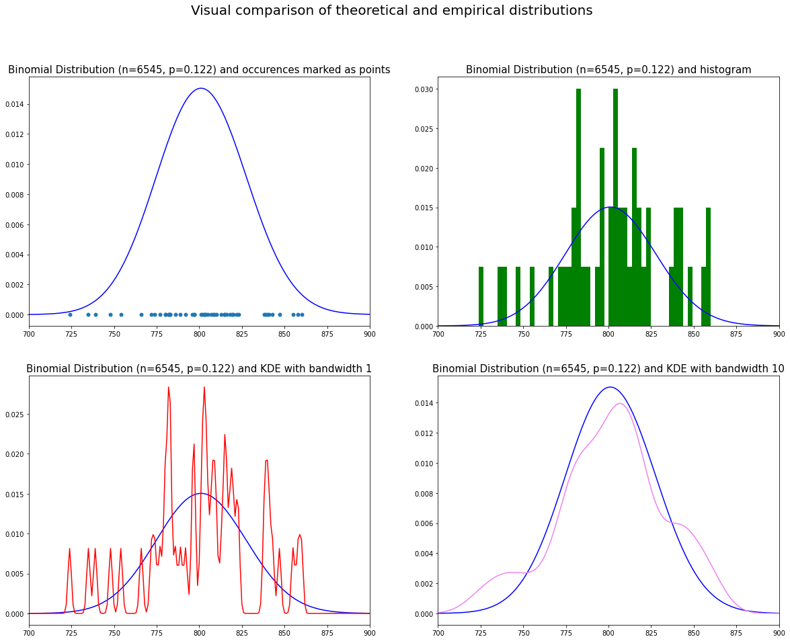

<script src="https://cdnjs.cloudflare.com/ajax/libs/require.js/2.3.6/require.min.js" integrity="sha512-c3Nl8+7g4LMSTdrm621y7kf9v3SDPnhxLNhcjFJbKECVnmZHTdo+IRO05sNLTH/D3vA6u1X32ehoLC7WFVdheg==" crossorigin="anonymous"></script>
<script src="https://cdnjs.cloudflare.com/ajax/libs/jquery/3.5.1/jquery.min.js" integrity="sha512-bLT0Qm9VnAYZDflyKcBaQ2gg0hSYNQrJ8RilYldYQ1FxQYoCLtUjuuRuZo+fjqhx/qtq/1itJ0C2ejDxltZVFg==" crossorigin="anonymous"></script>
<script type="application/javascript">define('jquery', [],function() {return window.jQuery;})</script>


-   <a href="#motivation" id="toc-motivation">Motivation</a>
-   <a href="#simple-data-checks" id="toc-simple-data-checks">Simple data
    checks</a>
-   <a href="#statistical-analysis"
    id="toc-statistical-analysis">Statistical Analysis</a>
-   <a href="#conclusions" id="toc-conclusions">Conclusions</a>
-   <a href="#what-if-the-lottery-was-more-complex"
    id="toc-what-if-the-lottery-was-more-complex">What if the lottery was
    more complex?</a>

# Motivation

When exploring a few notebooks that analyze lotteries on
[Kaggle](https://www.kaggle.com), I noticed that they mostly focus on
interactions and correlations between numbers. However, I haven't
encountered a notebook that would analyze the occurrence of numbers
using probability distributions. This notebook uses Python 3 to
investigate this by comparing the occurrence of numbers with their
theoretical distributions under the assumption that the lottery is fair.
It uses the data from a Polish lottery called 'Lotto' that can be found
[here](https://www.kaggle.com/datasets/radosawsierny/polish-lotto-dataset-19572021).

First, let's import libraries that will be used later and read the data.
The data contains dates of lotteries and numbers drawn.

``` python
import numpy as np
import pandas as pd
import matplotlib.pyplot as plt
from scipy.stats import binom
from sklearn.neighbors import KernelDensity

df = pd.read_csv('../../../data/dl.csv',
                 parse_dates=['date'],
                 dayfirst=True)
df.head()
```

<div>
<style scoped>
    .dataframe tbody tr th:only-of-type {
        vertical-align: middle;
    }

    .dataframe tbody tr th {
        vertical-align: top;
    }

    .dataframe thead th {
        text-align: right;
    }
</style>
<table border="1" class="dataframe">
  <thead>
    <tr style="text-align: right;">
      <th></th>
      <th>id</th>
      <th>date</th>
      <th>1</th>
      <th>2</th>
      <th>3</th>
      <th>4</th>
      <th>5</th>
      <th>6</th>
    </tr>
  </thead>
  <tbody>
    <tr>
      <th>0</th>
      <td>1.0</td>
      <td>1957-01-27</td>
      <td>8</td>
      <td>12</td>
      <td>31</td>
      <td>39</td>
      <td>43</td>
      <td>45</td>
    </tr>
    <tr>
      <th>1</th>
      <td>2.0</td>
      <td>1957-02-03</td>
      <td>5</td>
      <td>10</td>
      <td>11</td>
      <td>22</td>
      <td>25</td>
      <td>27</td>
    </tr>
    <tr>
      <th>2</th>
      <td>3.0</td>
      <td>1957-02-10</td>
      <td>18</td>
      <td>19</td>
      <td>20</td>
      <td>26</td>
      <td>45</td>
      <td>49</td>
    </tr>
    <tr>
      <th>3</th>
      <td>4.0</td>
      <td>1957-02-17</td>
      <td>2</td>
      <td>11</td>
      <td>14</td>
      <td>37</td>
      <td>40</td>
      <td>45</td>
    </tr>
    <tr>
      <th>4</th>
      <td>5.0</td>
      <td>1957-02-24</td>
      <td>8</td>
      <td>10</td>
      <td>15</td>
      <td>35</td>
      <td>39</td>
      <td>49</td>
    </tr>
  </tbody>
</table>
</div>

# Simple data checks

I performed some simple data checks, to ensure that there are no major
data errors. I checked whether there are any duplicates in `id` column
and whether there's a constant time difference between consequent
lotteries:

``` python
df['id'].duplicated().any()
```

    False

``` python
# Create column corresponding to difference between lotteries and print it
df = df.sort_values('date')
df['date_diff'] = df['date'].diff()
df.set_index('date')['date_diff'].dt.days.hist(bins=50)
plt.title("Histogram of time intervals between consecutive lotteries")
plt.show()
```


The histogram shows that there are various time intervals between
lotteries. It suggests that either the time intervals between lotteries
are complex or there are missing data points. In the latter case, the
analysis performed below is still valid as under the assumption that the
lottery is fair, each lottery is independent of one another! Finally, I
convert the dataframe to a numpy array and check whether the minimum and
maximum numbers are correct:

``` python
# Convert to numpy and check whether maximum and minimum are correct
numbers = df[['1', '2', '3', '4', '5', '6']].to_numpy()
print(numbers.max())
print(numbers.min())
```

    49
    1

# Statistical Analysis

In this particular Lottery, 6 numbers are drawn from a set {1, 2,...,
48, 49} without replacement. Note that the dataset contains ordered
numbers so we don't know which number was drawn first. As mentioned in
the beginning, let's forget the time dimension in this notebook and just
focus on the statistical analysis of the draws as a whole. We'll analyse
whether the frequency of drawn numbers is far from the distribution
under the null hypothesis that draws are random.

Let $X_i$ define a random variable that corresponds to the number of
times that number $i$ was drawn in all the lotteries. Then
$X \sim \mathcal{B}(\mathcal{n}, \mathcal{p})$ ($X$ follows a binomial
distribution with $n$ describing the number of trials and $p$ the
probability of success in every trial). In our case, we have $n = 6545$
and $p = \frac{6}{49}$.

We can easily calculate the occurrence of each number and check how it
corresponds to the probability mass of the theoretical distribution. The
occurrence can be represented as points on the graph or as a histogram
as shown in the upper two graphs in the cells below. One can also use
kernel density estimation (KDE;
https://en.wikipedia.org/wiki/Kernel_density_estimation) and compare a
theoretical distribution with the estimated probability density
function. The shape of KDE depends on the selected bandwidth: the higher
the value, the smoother the estimated distribution. The bottom graphs
show KDE based on Gaussian distribution with bandwidths equal to 1 and
10.

``` python
# Define p and n
p = 6 / 49
n = len(numbers)

# get array of occurences
a = np.unique(numbers, return_counts=True)[1]

# Create four subplots
fig, axs = plt.subplots(2, 2, figsize=(20, 15))
fig.suptitle('Visual comparison of theoretical and empirical distributions', fontsize=20)

# First plot
# Binomial dstribution and mark occurences as points
x = np.arange(0, n+1)
binomial_pmf = binom.pmf(x, n, p)
axs[0, 0].plot(x, binomial_pmf, color='blue')
axs[0, 0].plot(a, np.zeros(len(a)), marker='.', ls='none', ms=10)
axs[0, 0].set_title(f"Binomial Distribution (n={n}, p={np.round(p, 3)}) and occurences marked as points",
                    fontsize=15)
axs[0, 0].set_xlim(700, 900)

# Second plot
# Binomial dstribution and histogram
axs[0, 1].plot(x, binomial_pmf, color='blue')
axs[0, 1].hist(a, bins=50, density=True, color='green')
axs[0, 1].set_title(f"Binomial Distribution (n={n}, p={np.round(p, 3)}) and histogram",
                    fontsize=15)
axs[0, 1].set_xlim(700, 900)

# Third plot
# Binomial dstribution and KDE with bandwidth 1
axs[1, 0].plot(x, binomial_pmf, color='blue')
bandwidth = 1
kde = KernelDensity(kernel='gaussian', bandwidth=bandwidth).fit(a.reshape(-1,1))
probabilities = kde.score_samples(x.reshape(-1, 1))
probabilities = np.exp(probabilities)
axs[1, 0].plot(x, probabilities, color='red')
axs[1, 0].set_title(f"Binomial Distribution (n={n}, p={np.round(p, 3)}) and KDE with bandwidth {bandwidth}",
                    fontsize=15)
axs[1, 0].set_xlim(700, 900)

# Fourth plot
# Binomial dstribution and KDE with bandwidth 10
axs[1, 1].plot(x, binomial_pmf, color='blue')
bandwidth = 10
kde = KernelDensity(kernel='gaussian', bandwidth=bandwidth).fit(a.reshape(-1,1))
probabilities = kde.score_samples(x.reshape(-1, 1))
probabilities = np.exp(probabilities)
axs[1, 1].plot(x, probabilities, color='violet')
axs[1, 1].set_title(f"Binomial Distribution (n={n}, p={np.round(p, 3)}) and KDE with bandwidth {bandwidth}",
                    fontsize=15)
axs[1, 1].set_xlim(700, 900)
```

    (700.0, 900.0)



# Conclusions

The graphs above suggest that there's nothing strange going on here. The
points are marked around the area with the highest probability mass on
the top left graph and KDE with high bandwidth parameter closely
resembles the theoretical distribution, especially considering that we
only have 49 observations here (one for each number). Based on this, we
cannot conclude that lottery is unfair. However, note that this is a
simplistic conclusion based on observation. As the next step,
statistical tests could be performed to investigate more closely the
relationship between a theoretical distribution and the observations.
For this purpose, an asymptotic Chi-Square developed by Genest, Lockhart
and Stephens (2001) could be used
(https://www.semanticscholar.org/paper/Chi-square-and-the-Lottery-Genest-Lockhart/3daa79fe92c0a5ce8204bb984ba81c25ce4143e0).

# What if the lottery was more complex?

In the case above, the theoretical distribution of the occurrence of the
numbers was easy to deduct. However, a lottery can be much more complex
and it can prove difficult to derive a theoretical distribution. In this
case, we can use Monte Carlo simulation to approximate the theoretical
distribution. This distribution is asymptotically equivalent to the
theoretical one (when the number of simulations used in Monte Carlo
approaches infinity, then this distribution also approaches the
theoretical distribution. Below I show a code snippet that could be used
to perform a Monte Carlo simulation for our simple lottery.

``` python
# Monte Carlo to simulate draws
def create_random_lotto(size=6,
                        min_number=1,
                        max_number=49,
                        with_replacement=False,
                        **kwargs):
    a = np.arange(min_number, max_number + 1)
    return np.random.choice(a=a, size=size, replace=False, **kwargs)

def create_multiple_random_lottos(number_lotto_draws=6545,
                                  size_single_draw=6,
                                  min_number=1,
                                  max_number=49,
                                  with_replacement=False,
                                  **kwargs):
    a = np.empty(shape=(number_lotto_draws, size_single_draw), dtype=np.int8)
    for i in range(number_lotto_draws):
        a[i, :] = create_random_lotto(
            size=size_single_draw,
            min_number=min_number,
            max_number=max_number,
            with_replacement=with_replacement,
            **kwargs)
    return a

def monte_carlo(n_samples=100000,
                number_lotto_draws=6545,
                size_single_draw=6,
                min_number=1,
                max_number=49,
                with_replacement=False,
                **kwargs):

    return np.vstack([create_multiple_random_lottos(
        number_lotto_draws=number_lotto_draws,
        size_single_draw=size_single_draw,
        min_number=min_number,
        max_number=max_number,
        with_replacement=with_replacement,
        **kwargs) for x in range(n_samples)])
```
